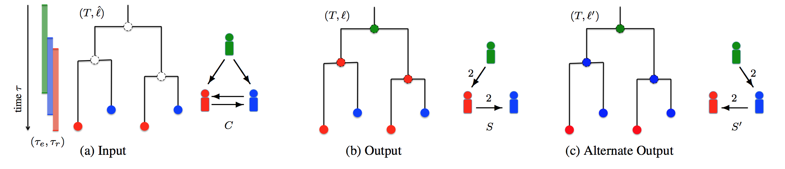

# TiTUS - Transmission Tree Uniform Sampler

TiTUS is a code that takes as input a timed pathogen phylogeny with leaves
labelled by the host along with epidemiological data such as
entry-removal times for the hosts and a contact map. It counts and
uniformly samples from the set of feasbile interval vertex labelings of
the timed phylogeny that satisfy the direct transmission constraint
while supporting a weak transmission bottleneck

(a) The input of the problem consists of a timed phylogeny T that captures the
evolutionary history of the pathogen during the course of the outbreak. Each leaf of T corresponds to a sample collected for an individual host (indicated by colors). The entry and removal times [τe(s), τr(s)] for each host are also included in the input. (b) Our aim is to label the
internal vertices of T with such that the resulting transmission edges form a transmission tree S. Each edge (s, t) of S is weighted
by the number of transmission edges from host s to host t given by the vertex labeling (c) An alternative solution to the given DTI instance. It is easy
to see that no solution exists under the strong bottleneck constraint whereas under the weak transmission bottleneck there are multiple solutions

## Contents

  1. [Compilation instructions](#compilation)
     * [Dependencies](#dep)
     * [Compilation](#comp)
  2. [Usage instcructions](#usage)
     * [I/O formats](#io)
     * [Naive Labeling](#sankoff)
     * [Naive Sampling](#sample)
     * [SAT Formulation](#sat)
     * [Single Consensus Transmission Tree](#sctt)

## Compilation instructions

### Dependencies

SharpTNI solver is written in C++11 and requires a modern C++ compiler
(GCC >= 4.8.1, or Clang). In addition it has the following dependencies

* [CMake](http://www.cmake.org/) (>=3.1)
* [Boost](http://www.boost.org) (>= 1.38)
* [LEMON](http://lemon.cs.elte.hu/trac/lemon) graph library (>= 1.3)

[Graphviz](http://www.graphviz.org) is required to visualize the resulting DOT files, but is not required for compilation.

<!--In case [doxygen](http://www.stack.nl/~dimitri/doxygen/) is available, extended source code documentation will be generated.-->

### Compilation

To compile execute the following commands from the root of the
repository

    $ mkdir build
    $ cd build
    $ cmake ..
    $ make

In case CMake fails to detect LEMON, run the following command with adjusted paths:

    $ cmake -DLIBLEMON_ROOT=~/lemon

The compilation results in the following files in the `build' directory

EXECUTABLE       | DESCRIPTION
-----------------|-------------
`naive`        | count/enumerate all the vertex labelings that satisfy the contact map
`naive_sample` | uniformly sample all vertex labelings that satisfy the contact map
`dimacs`         | SAT formulation for DTI problem
`sctt`          | find the single consensus tree for a given set of candidate transmission trees

## Usage instructions

### I/O formats

The TiTUS input is text based. There are two input files, host file
and ptree file. Each line of the host file has exactly 3 entries separated by ' '.
The format of each line of the host file is '\<host name\> \<entry time\> \<removal time\>' in
each line. The number of lines in the host file is the number of sampled hosts.
A ptree file gives the timed phylogeny with the leaf labeling. Each line
of ptree file has exactly 4 entries separated by ' '. The
format for each line of the ptree file is '\<node name\> \<child1 name\> \<child2 name\> \<host label\>'. The number of lines in the ptree file is the number of nodes in the timed phylogeny. The nodes of the tree in the file must be in post-order (all nodes must be preceded by their children). For a leaf the <child name> must be '0'.

###  Naive Labeling (`naive`)

	Usage:
	  ./naive [--help|-h|-help] [-c] [-e] [-l int] [-m str] [-p] [-r int] [-t]
	     [-u int] <host> / <transmission_tree> <ptree> <output_ptree>
	Where:
	  --help|-h|-help
	     Print a short help message
	  -c
	     Find consensus Sankoff solution (deafault: false)
	  -e
	     Enumerate all the solutions (default: false)
	  -l int
	     Enumeration solution number limit (default: intMax)
	  -m str
	     Contact map file: (default: empty)
	  -p
	     Parsimony flag (default: false)
	  -r int
	     Root label (default: 0)
	  -t
	     Transmission tree instead of host file
	  -u int
	     Number of unsampled hosts (default: 0)

### Naive Sampling (`naive_sample`)

	Usage:
	  ./naive_sample [--help|-h|-help] [-l int] [-m str] [-r int] [-u int] <host>
	     <ptree> <output_prefix>
	Where:
	  --help|-h|-help
	     Print a short help message
	  -l int
	     Number of samples (default: 11000)
	  -m str
	     Contact map file: (default: empty)
	  -r int
	     Root label (default: 0)
	  -u int
	     Number of unsampled hosts (default: 0)

### SAT formulation (`dimacs`)

	Usage:
	  ./dimacs [--help|-h|-help] [-c str] [-i str] [-r int] [-s] [-u int] <host>
	     <ptree> <output_dimacs_file> <output_varlist_file>
	Where:
	  --help|-h|-help
	     Print a short help message
	  -c str
	     contact map file: (default: empty)
	  -i str
	     infection window file: (default: empty)
	  -r int
	     Root label (default: 0)
	  -s
	     strong bottleneck flag: (default: false)
	  -u int
	     Number of unsampled hosts (default: 0)

### Single Consensus Transmission Tree (`sctt`)

	Usage:
	  ./sctt [--help|-h|-help] [-c str] [-m str] <host>
	     <transmission tree prefix> <output_ptree_file>
	Where:
	  --help|-h|-help
	     Print a short help message
	  -c str
	     contact map file: (default: empty)
	  -m str
	     Contact map file: (default: empty)
